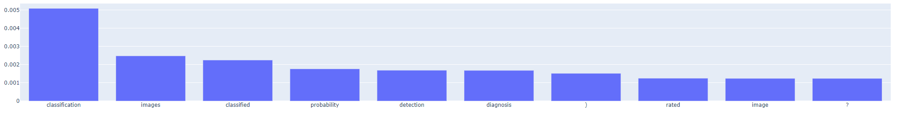
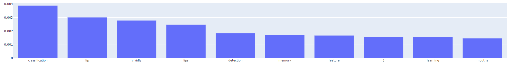
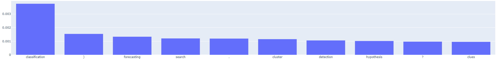

# Embedding Entropy

Consider a database of texts, all on a very similar theme, and their corresponding vector embeddings. In this repository, we explore [this](https://huggingface.co/datasets/CShorten/ML-ArXiv-Papers) database of machine learning paper titles
and abstracts. The embedding model used is [Ollama's nomic-embed-text](https://ollama.com/library/nomic-embed-text), which is trained
on more a generic corpus of text.

The aim of this repository is to demonstrate that the entropy of the embeddings in the dataset is considerably less than that
of a broad corpus of text, that is it contains less information, and some of the implications. Ultimately, this might
be used to quantify the theoretical maximum improvement in performance from a custom embedding model trained on the corpus in question,
or maximum theoretical lossless dimensionality reduction on the vectors.

## Why does entropy matter?

Consider a 1D case of a single floating point value which encodes semantic meaning (varying between -1 and 1, for simplicity), and three possible distributions:
- `A`: A uniform distribution over possible values.
- `B`: A tightly clustered distribution, where 90% of all data points are within (0.5, 0.6).
- `C`: A delta function centred on -0.2 (that is, every datapoint has precisely the same value).

Case `A` contains the most information, since we update our understanding of a piece of data the most when we learn its value (our prior on the 
value was the most uncertain). Case `C` contains precisely no information - observing a data point does not update our understanding of it at all,
since our prior and posterior are identical. Case `B` is in between, providing some information but less than case `A`. Information theory
allows us to rigorously quantify how much information a distribution contains. See: https://en.wikipedia.org/wiki/Principle_of_maximum_entropy.

### Note on Resolution
Using continuous distributions requires some "resolution" to keep the entropy finite. By "resolution" we mean something like 
how closely two vectors can be which we can still "resolve". Quantization is an obvious choice, but in general if there is some uncertainty in the embedded
value, or some noise introduced by imperfect models, then this can be translated into a resolution (e.g. using 128-bit floating point values instead of 32-bit doesn't necessarily increase
true resolution). 

In fact, since the embeddings are intended for use in a search process, what we mean by resolution is really how close can
the vectors be while some sensible query vector can distinguish between them (i.e. one is preferred by some distance metric).
If the vectors are too close, then which one is closer to some query vector is essentially random chance, meaning they cannot be said to be "resolved".

In this repository, we will not try to assign entropy to the distributions, but rather relative entropy between them, which is a finite term
and hence we don't need to define or compute some model of resolution. In particular, we will compute the [KL Divergence](https://en.wikipedia.org/wiki/Kullback%E2%80%93Leibler_divergence)
between the two datasets, which is closely related to the [entropy measure for continuous distributions](https://en.wikipedia.org/wiki/Limiting_density_of_discrete_points).

# Extracting Meaning
During this investigation and the supporting interface, some intuition about the vectors is provided by comparing each vector
to the embeddings of the 10,000 most common English words (by taking the cosine difference and applying a softmax transform):

For example, the following two images come from two randomly selected samples of vectors representing the ML papers:

And this one is the mean vector in the database - the "average" ML paper:

Note, observing that the results are very similar in every case gives some intuition that much of the information stored in
these vectors is obsolete - that is, cannot be used to distinguish between them.

# Workflow

The steps involved in this investigation/application:

- Setup: create docker app containing Weaviate server and supporting modules (in this case, Ollama).
- Define collections for a "paper" (containing a title and abstract text) and a "word" (containing a single word).
  - Define both to use the same embedding model: Ollama's `nomic-embed-text`
- Fetch datasets for Machine Learning Papers (from [here](https://huggingface.co/datasets/CShorten/ML-ArXiv-Papers)) and for common words (The "Brown" corpus from [here](https://www.nltk.org/nltk_data/)) and ingest both into our Weaviate server.
- Compute covariance and mean of a sample of (10,000) vectors in each dataset, from which we estimate a Multivariate Normal Distribution.
- Use closed form equations of the two distributions to compute the total KL Divergence between the ML Paper dataset and the words dataset - this represents the number of bits of information gained by knowing a sample is distributed according to the ML Paper dataset (or how much superfluous information is in this dataset, from the perspective of the words dataset).
- Use Principal Component Analysis to decompose the distribution of ML Paper vectors into approximately independent basis vectors.
- Use closed form equations to compute the Marginal KL Divergence of each basis vector on its own between the ML Paper dataset and the words dataset.
- After selecting two basis vectors:
  - Compute the cosine similarity between the basis vectors and every word in the words dataset. Display the most likely ones.
  - Project the Multivariate Normal Distributions of the two datasets into this 2d space, and plot the surfaces of the probability density functions.
  
A Flask app is used to host a basic web server for interacting with some of the analysis. 

## Future

With more time, some future points to explore:

- Compare alternative embedding approaches, perhaps including one trained specifically on a particular dataset which can be compared.
- Include this information in querying, e.g.:
  - rerank documents according to individual entropies - those with more information are preferred.
  - analyse vector embeddings of queries:
      - Interpret them according to PCA vectors
      - Optimize them by increasing information content
  - Dynamically control the number of returned documents based on the information in the query and relevant data. More documents might be needed where information content is
    sparse (that is, it is hard to distinguish between documents based on the query vector).  
